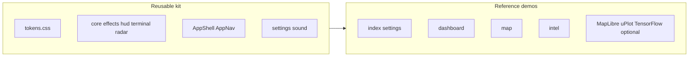

# Architecture

This repo is an **Astro** site: mostly static HTML with **optional islands** (React) where motion, charts, mapping, or ML justify the bundle.

## Kit vs demo

Reusable pieces compose into full pages; demo routes are reference implementations.

| Layer        | Role |
| ------------ | ---- |
| **Tokens**   | `src/styles/tokens.css` + Tailwind plugin `src/plugins/sci-fi.mjs` define the visual language. |
| **Primitives** | `src/components/core/`, `effects/`, `hud/`, `terminal/`, `radar/` — building blocks for any page. |
| **Shell**    | `AppShell.astro` (background, boot script), `AppNav.astro` — shared page chrome. |
| **Layout**   | `ScifiLayout.astro` — document shell, fonts, inline settings bootstrap (FOUC avoidance). |
| **Lib**      | `src/lib/settings.ts`, `sound.ts`, `animation.ts`, `map-cities.ts` — settings, audio, and shared map/weather city presets. |
| **Demo pages** | `index.astro` (landing), `kit.astro` (component showcase), `settings.astro` (shell prefs), `dashboard.astro`, `map.astro`, `intel.astro` — showroom wiring; safe to replace in forks. |

Heavy client features (uPlot, MapLibre, TensorFlow.js) are isolated to specific routes or components and can be disabled with `PUBLIC_*` env flags — see the [README](../README.md) and [`.env.example`](../.env.example).
